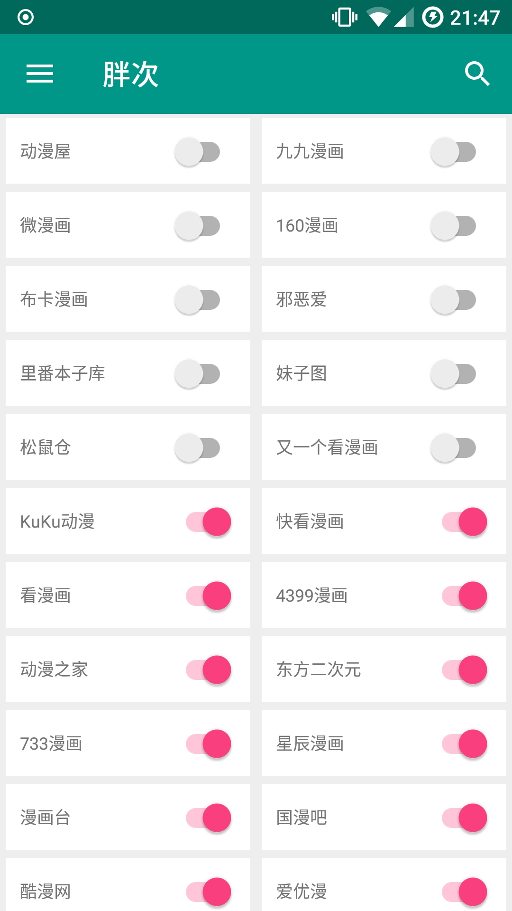
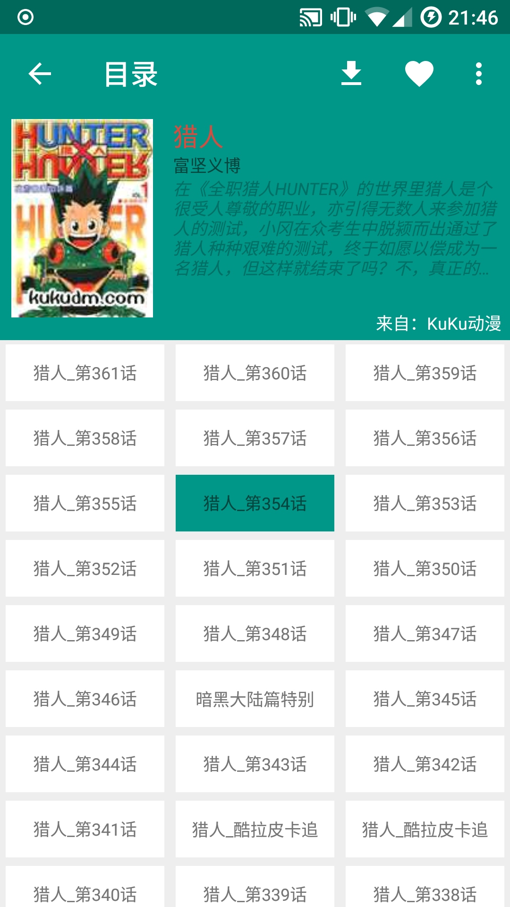

# 应用简介
基于SiteD引擎的看漫画app，个人学习用。

# 感谢以下的开源项目及作者
- [Cimoc](https://github.com/Arachnid-27/Cimoc)
- [PracticalRecyclerView](https://github.com/ssseasonnn/PracticalRecyclerView)
- [SiteD](https://github.com/noear/SiteD)
- [ButterKnife](https://github.com/JakeWharton/butterknife)
- [GreenDAO](https://github.com/greenrobot/greenDAO)
- [OkHttp](https://github.com/square/okhttp)
- [Glide](https://github.com/bumptech/glide)
- [RxJava](https://github.com/ReactiveX/RxJava)
- [RxAndroid](https://github.com/ReactiveX/RxAndroid)
- [J2V8](https://github.com/eclipsesource/J2V8)

# 应用截图

